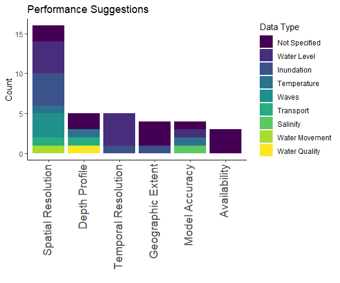
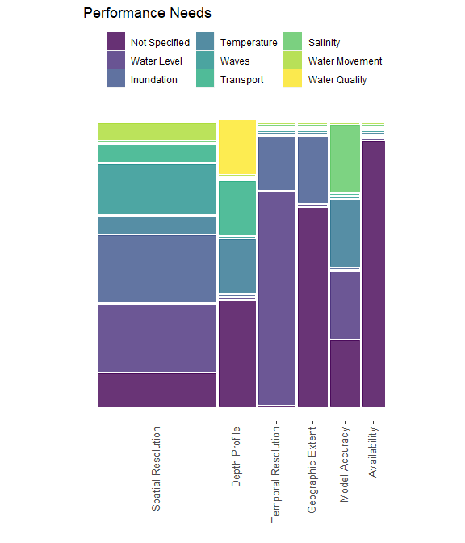
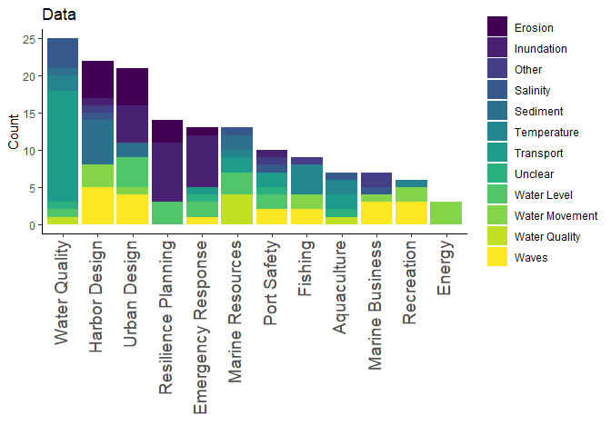
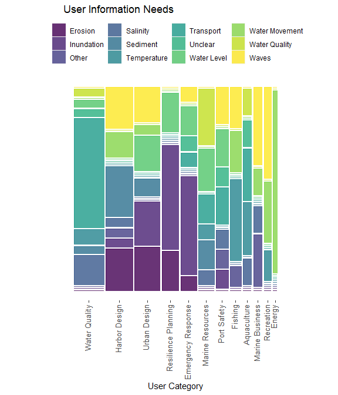

Mosaic Plot From Portland Harbor Model Workshops
================
Curtis C. Bohlen
2022-12-09


# Introduction

CBEP recently received a grant from NSF’s CIVIC Innovation Challenge to
work on developing hydrodynamic models that address community needs in
Portland Harbor. As part of the project, CBEP hosted three community
workshops in November of 2022.

Facilitators produced both “live” notes during the meeting – visible to
all on a screen at the front of the meeting room – and detailed meeting
transcripts. CBEP staff then reviewed those notes paragraph by
paragraph, and coded each paragraph in terms of six characteristics:

- Potential users and uses of hydrodynamic models,

- Data or information needs identified by community members,

- Implied extensions of the initial Casco Bay Model required to fully
  address those data needs, and

- Ideas for improving communications of model results (e.g.,
  communications channels and user interface design),

- Specifications for model performance or data criteria such as
  resolution, geographic coverage or ability to conduct simulations.

- Suggestions about monitoring or data collection that could improve
  information availability.

If a paragraph or live note included something relevant to one or more
of these categories, we summarized the related idea, and then assigned
each paragraph or comment to categories. In this way we can look at what
ideas were expressed most commonly during the workshops.

Of course, not all paragraphs include information related to each of the
six types of information, so there is not a perfect one-to-one
correspondence between categories.

In this R Notebook, I generate a few mosaic plots. I isolate this code
here because the mosaic plots were crashing rendering of PDF documents.

# Load Packages

``` r
library(tidyverse)
#> ── Attaching packages ─────────────────────────────────────── tidyverse 1.3.2 ──
#> ✔ ggplot2 3.4.0      ✔ purrr   1.0.1 
#> ✔ tibble  3.1.8      ✔ dplyr   1.0.10
#> ✔ tidyr   1.2.1      ✔ stringr 1.5.0 
#> ✔ readr   2.1.3      ✔ forcats 0.5.2 
#> ── Conflicts ────────────────────────────────────────── tidyverse_conflicts() ──
#> ✖ dplyr::filter() masks stats::filter()
#> ✖ dplyr::lag()    masks stats::lag()
library(ggmosaic)
library(readxl)
library(networkD3)

theme_set(theme_classic())
```

# Create Figures Folder

``` r
dir.create(file.path(getwd(), 'figures'), showWarnings = FALSE)
```

# Load Data

``` r
the_data <- read_excel("Data_Export_Query.xlsx" ) %>%
  mutate(ID = as.integer(ID)) %>%
  rename_with(function(x) sub(" Category_Category", '_Category', x)) %>%
  rename_with(function(x) sub(" ", '_', x))
head(the_data)
#> # A tibble: 6 × 16
#>      ID Category   Day   Comment User_…¹ Inter…² Inter…³ Data_…⁴ Data_…⁵ Exten…⁶
#>   <int> <chr>      <chr> <chr>   <chr>   <chr>   <chr>   <chr>     <dbl> <chr>  
#> 1     1 Live Comm… Day … How ca… Urban … Simple  Exampl… <NA>         NA Draina…
#> 2     2 Live Comm… Day … Use of… Harbor… <NA>    <NA>    Waves         4 <NA>   
#> 3     2 Live Comm… Day … Use of… Marine… <NA>    <NA>    Waves         4 <NA>   
#> 4     2 Live Comm… Day … Use of… Urban … <NA>    <NA>    Waves         4 <NA>   
#> 5     3 Live Comm… Day … MS4 pr… Water … Inform… Shared… <NA>         NA Discha…
#> 6     3 Live Comm… Day … MS4 pr… Water … Inform… Shared… <NA>         NA Draina…
#> # … with 6 more variables: Extension_Timing <dbl>, Monitoring_Category <chr>,
#> #   Monitoring_Data_Group <dbl>, Performance_Category <chr>,
#> #   Performance_Type <dbl>, Performance_Timing <dbl>, and abbreviated variable
#> #   names ¹​User_Category, ²​Interface_Category, ³​Interface_Group, ⁴​Data_Group,
#> #   ⁵​Data_Timing, ⁶​Extension_Category
```

Our coding was generated in a somewhat sloppy `Access` database, and
because of the way SQL works, it is easier to replace numerical values
for some groups here, in `R`, rather than before we exported the data
from `Access`. I read in the dictionaries here.

``` r
timing_table <- read_excel("Timing Category.xlsx", 
    col_types = c("numeric", "text", "text"))
data_types_table <- read_excel("Data Type.xlsx", 
    col_types = c("numeric", "text", "text"))
```

## Numerical Values to Strings

And finally I correct the data table to all text entries.

``` r
the_data <- the_data %>%
  mutate(Data_Timing = timing_table$Timing[match(Data_Timing, 
                                                 timing_table$ID)],
         Extension_Timing = timing_table$Timing[match(Extension_Timing,
                                                      timing_table$ID)],
         Performance_Timing = timing_table$Timing[match(Performance_Timing,
                                                      timing_table$ID)]) %>%
  mutate(Monitoring_Data_Group = data_types_table$Group[match(Monitoring_Data_Group,
                                                    data_types_table$ID)],
         Performance_Type = data_types_table$Group[match(Performance_Type,
                                                    data_types_table$ID)])
```

\#A Warning about Uniqueness We have to be careful here, because each
note or comment can be represented in this data table multiple times.
Each paragraph in the meeting transcript might imply several different
users, for example. But if there are multiple users and multiple data
types, the records got duplicated (in part) in the SQL query. So for any
analysis, we need to test for uniqueness of the data. always

We actually have over 375 records, built out of just over 200 unique
comments.

``` r
cat("All rows in the data:\t\t")
#> All rows in the data:        
nrow(the_data)
#> [1] 376

cat("Unique comments reviewed:\t")
#> Unique comments reviewed:    
the_data %>%
  select(ID) %>%
  unique() %>%
  nrow()
#> [1] 207
```

# Model Performance

``` r
tmp <- the_data %>%
  select(ID, Performance_Category, Performance_Type, Performance_Timing) %>%
  unique() %>%
  filter(if_any(starts_with('Performance_'), ~!is.na(.))) %>%
  filter(! is.na(Performance_Category),
           Performance_Category != "Timing" )  %>%
  mutate(Performance_Category = fct_infreq(Performance_Category),
         Performance_Type = fct_infreq(Performance_Type),
         Performance_Timing = fct_infreq(Performance_Timing))
```

``` r
ggplot(tmp, aes(Performance_Category)) +
  geom_bar(aes(fill = Performance_Type)) +
  theme(axis.text.x = element_text(angle = 90, size = 14,
                                   hjust = 1, vjust = 0.25)) +
  scale_fill_viridis_d(name = 'Data Type') +
  ylab('Count') +
  xlab("") +
  ggtitle("Performance Suggestions")
```

<!-- -->

## Testing Mosaic Plots

The \`ggmosaic’ package allows mosaic plots, but it’s a but buggy and
hard to use. Note that if I plot the mosaic plot directly, it crashes
rendering of the PDF document. The workaround here simply saves a
graphic and then displays it.

``` r
the_mosaic <- ggplot(tmp) +
  geom_mosaic(aes(x = product(Performance_Category), 
                  fill = Performance_Type)) +
  scale_fill_viridis_d(name = 'Data Type') +
  ggtitle("Model Performance") +
  theme_mosaic() +
  theme(axis.text.x = element_text(angle = 90, size = 12, 
                                   hjust = 1, vjust = 0.25),
          axis.text.y = element_text(size = 12)) +
  xlab('') +
  ylab('')

the_mosaic
#> Warning: `unite_()` was deprecated in tidyr 1.2.0.
#> ℹ Please use `unite()` instead.
#> ℹ The deprecated feature was likely used in the ggmosaic package.
#>   Please report the issue at <]8;;https://github.com/haleyjeppson/ggmosaichttps://github.com/haleyjeppson/ggmosaic]8;;>.
```

<!-- -->

``` r
ggsave('figures/Performance_Mosaic.png', the_mosaic, type='cairo',
         width = 6, height = 5)
```

On the whole, what we see is that people commented repeatedly on the
need for high spatial resolution information, especially with regards to
water level, inundation, and waves. Many comments also good temporal
resolution for water level data - -often associates with forecasting
tidal datums for habitat restoration. Finally, numerous comments focused
on geographic extent and model availability, but those comments were
usually generic, and not tied to specific data needs or requests.

It is possible to layer a third variable into these Mosaic Plots, or to
use `ggplot` faceting functions to look at three way contingency tables,
but in this setting, it’s just confusing. We have too many possible
divisions of the three variables associated with each performance
comment.

\#Users and Data Types

``` r
reduced_data <- the_data %>%
  select(ID, User_Category, Data_Group) %>%
  unique() %>%
  filter(! is.na(User_Category), 
         ! is.na(Data_Group)#,
         #User_Category != "Other",      # Dropped because none have timing
         #Data_Timing != 'Unclear'       # Dropped because uninformative.    
         ) %>%  
  mutate(User_Category = fct_infreq(User_Category),
         Data_Timing = fct_infreq(Data_Group))
   
  ggplot(reduced_data, aes(User_Category)) +
  geom_bar(aes(fill = Data_Group)) +
  theme(axis.text.x = element_text(angle = 90, size = 14,
                                   hjust = 1, vjust = 0.25)) +
  scale_fill_viridis_d(name = '') +
  ylab('Count') +
  xlab("") +
  ggtitle("Data")
```

<!-- -->

``` r
the_mosaic <- ggplot(reduced_data) +
  geom_mosaic(aes(x = product(User_Category), 
                  fill = Data_Group)) +
  scale_fill_viridis_d(name = '') +
  ggtitle("User Information Needs") +
  theme_mosaic() +
  theme(axis.text.x = element_text(angle = 90, size = 10, 
                                   hjust = 1, vjust = 0.25),
          axis.text.y = element_blank(),
        axis.ticks.y = element_blank(),
        legend.position = 'top') +
  guides(fill=guide_legend(nrow=3)) +
  xlab('User Category') +
  ylab('')

the_mosaic
```

<!-- -->

``` r
ggsave('figures/User_Needs_Mosaic.png', the_mosaic, type='cairo',
         width = 6, height = 5)
```
